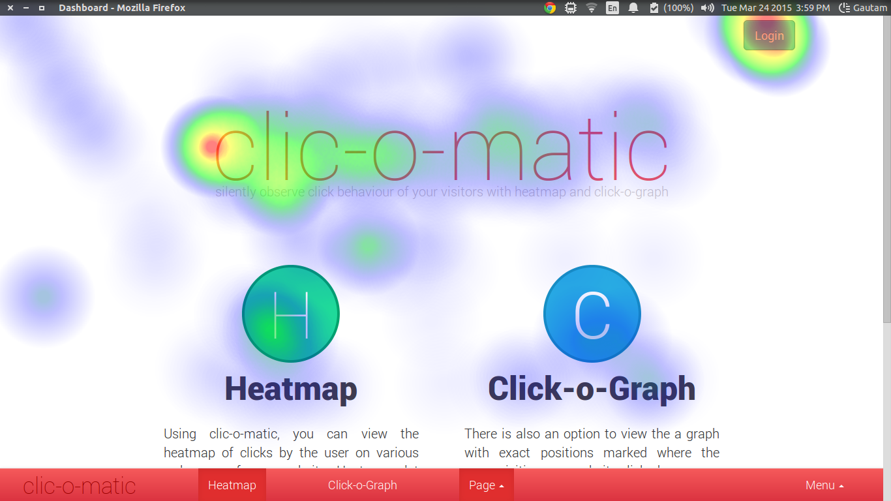
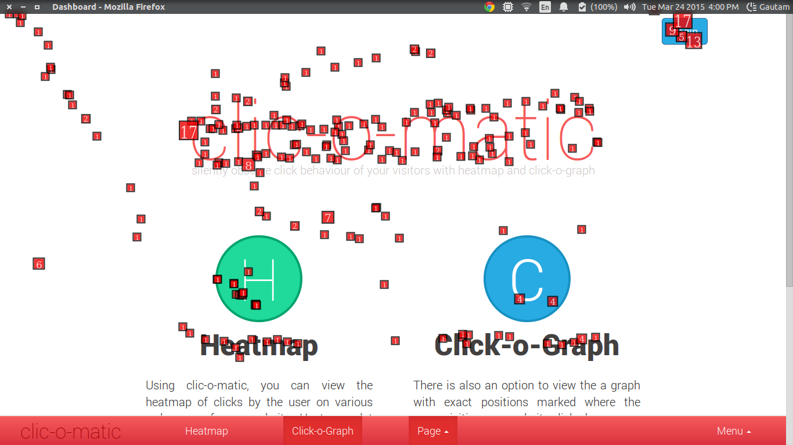

#clic-o-matic

clic-o-matic is a tool for automating the task of observing user's click behaviour on any website.
Create a login, add your url in the app, add a simple code snippt in your website and you can view the heatmap and click-o-graph of your webpage simply by logging in into the app.

## Local Development Enviornment Setup :

1. Install virtualenv:
 ```
 install virtualenv
 pip install virtualenv
 ```
 or follow [this](http://docs.python-guide.org/en/latest/dev/virtualenvs/) for installing virtualenv.

 If you do not have pip installed:
 ```
 sudo apt-get install python-pip
 ```

2. Clone the repository on local machine:
 ```
 git clone https://github.com/GautamAnghore/clic-o-matic
 ```

 
3. cd into the project directory:
 ```
 cd clic-o-matic
 ```

4. Create a new virtual enviornment with python version 2.7:
 ``` 
 virtualenv -p /usr/bin/python2.7 venv
 ```

5. Activate the virtual enviornment:
 ```
 source venv/bin/activate
 ```

6. Install the requirements:
 ```
 pip install -r requirements.txt
 ```

7. Install MongoDB using the [official guide](http://docs.mongodb.org/manual/tutorial/#getting-started)(the development was done on mongodb v2.4.9).

### Running the Development Server:

 + First start the mongod server on port 27017 (default),
  ```
  sudo service mongodb start
  ```

 + Now, from the project root directory, start the development server
  ```
  python run.py
  ```

 Visit `http://localhost:5000/` and you will see the project running.

### Trying Example:

 + `test-webpage` contains the example webpage with the code snippt already copied.
 + Run any other server on a port other than 5000.
 	
 	For example, if you are using xampp
 	 + Paste the folder `test-webpage` inside `htdocs` folder.
 	 + Visit `http://localhost/test-webpage/home.html`.
 + On the app's home page `http://localhost:5000/`, click on Get Started and Sign up.
 + Add url `http://localhost/test-webpage/home.html` in the app. The code snippt is already pasted.
 + Now the your clicks on the test-webpage `http://localhost/test-webpage/home.html` will be tracked by the app.
 + Visit the app's dashboard and refresh.
 + Heatmap
 
 + Click-o-Graph
 


## Frameworks and Libraries Used: 

 + [Flask](http://flask.pocoo.org/)
 + [Flask-cors](https://pypi.python.org/pypi/Flask-Cors/1.10.3)
 + [Heatmap.js](http://www.patrick-wied.at/static/heatmapjs/)

## Future Work:

 + Deployment
 + Improve the UI (specially Signup and Login page)
 + Few improvements (marked by comment `flag` )


